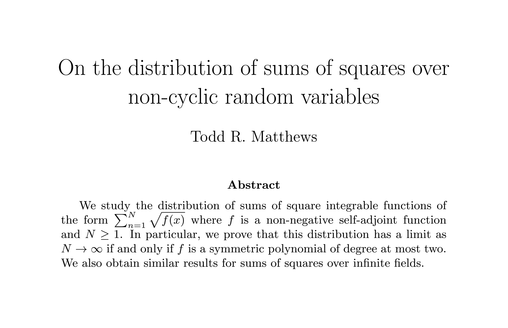
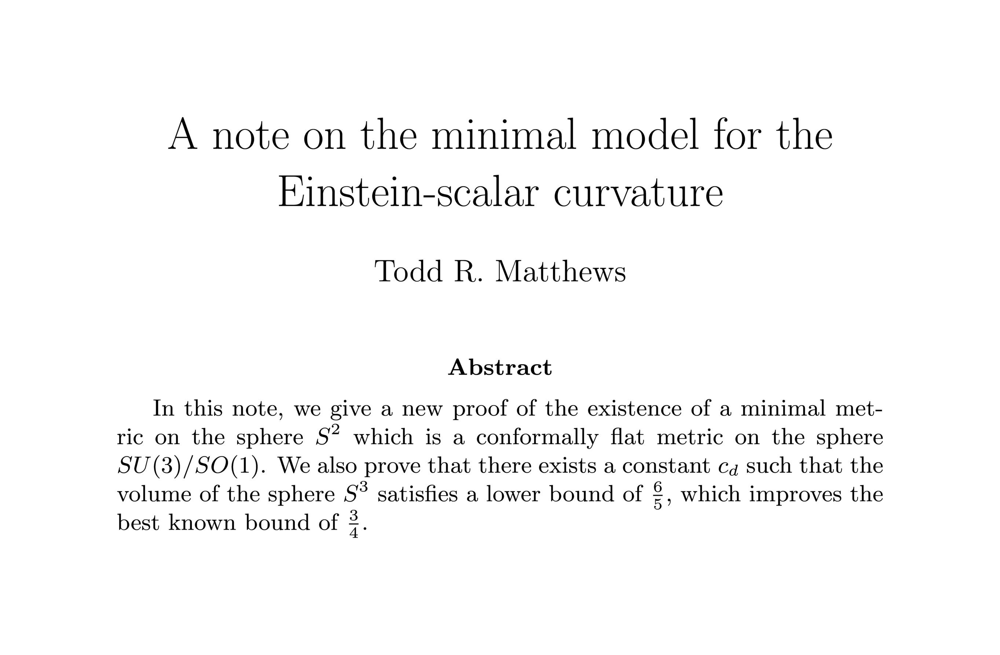
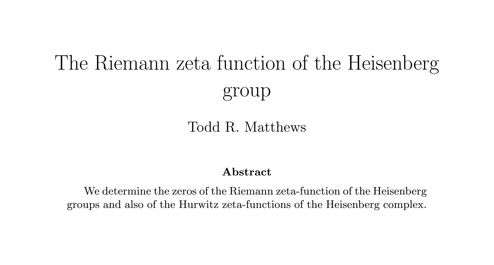

# Abstract generator and classifier

This project consists of a math abstract generator and classifier.
Both use fine-tuned versions of GPT-2 or GPT-Neo. All of my testing was done with the small (125 million parameter) GPT-Neo model.
They are prepared to be trained on the [arXiv dataset on Kaggle](https://www.kaggle.com/Cornell-University/arxiv).

## Generator

The generator can write an abstract when given a title or when given a title and a collection of arXiv categories, or write both a title and an abstract when given a collection of categories. Here are some examples of generated titles and abstracts:

For more examples, check out [Totally Real Math Abstracts](https://twitter.com/mathAbstracts) on Twitter.

## Classifier

Given a title and an abstract, the classifier makes predictions on what arXiv categories (e.g. `math.NT` or `math.AG`) the corresponding preprint belongs to. As an example, the results I obtained after 2 hours of training were the following:

| Scoring criterion             | Score |
| ----------------------------- | ----- |
| All categories correct        | 37%   |
| At least one correct category | 78.4% |
| Overall                       | 56%   |

One should note that preprints in arXiv usually belong to more than one category, and what branches a given piece of mathematics belongs to is not usually clear-cut and is open to interpretation (to a certain degree).
In light of this, these results are quite good.

## Usage

First, one must include the [arXiv Kaggle dataset](https://www.kaggle.com/Cornell-University/arxiv) in [`dataset/`](dataset/) as `dataset.json` and run [`dataset/process.py`](`dataset/process.py), which will output a file named `processed.json` in the same directory.

One can then train the classifier by running [`classifier/train.py`](classifier/train.py), and test it using [`classifier/evaluate.py`](classifier/evaluate.py).

Similarly, run [`generator/train.py`](generator/train.py) and [`generator/evaluate.py`](generator/evaluate.py) to train and evaluate the generator model. To save the results of the text generation, set `SAVE_TO_FILE` to `True` in the latter file, and execute [`generator/render.py`](generator/render.py) to render the results into PNG files (using `pdflatex` and `dvipng`), which will be saved in `generator/images/`.
